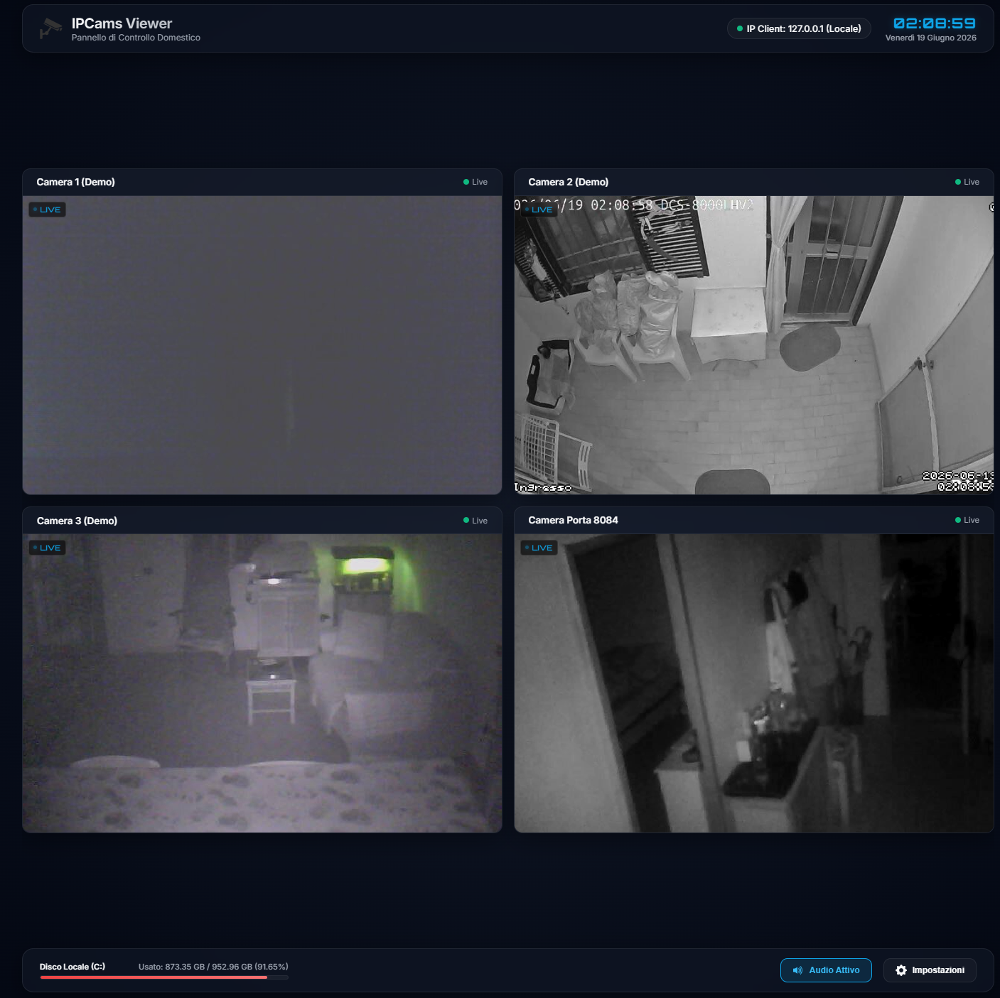
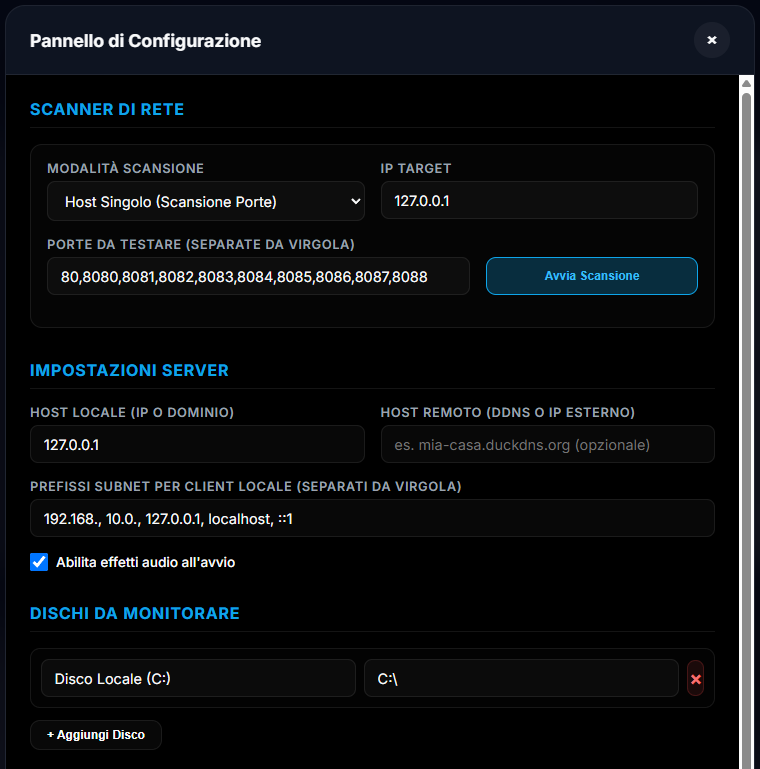
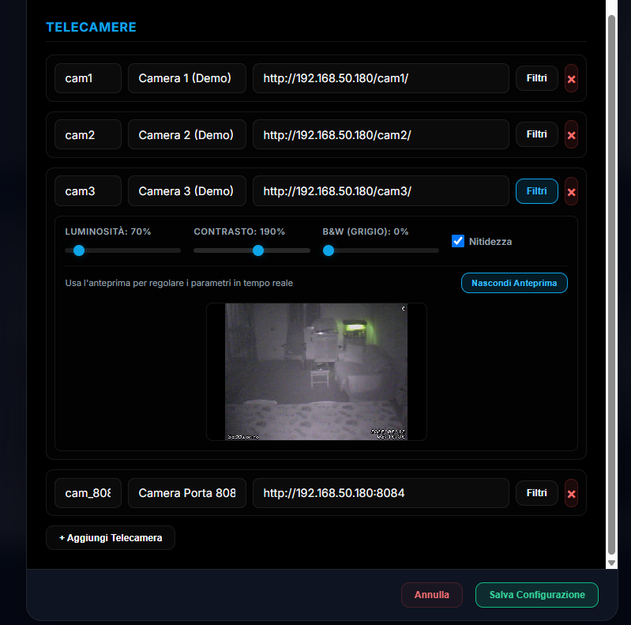

# IPCams Viewer v2.0

Pannello di controllo moderno, reattivo e basato su glassmorphism per il monitoraggio e la gestione di flussi video M-JPEG/RTSP provenienti da telecamere IP locali e remote.

| Grid View | Configuration & Scanner | Image Calibration |
| :---: | :---: | :---: |
|  |  |  |

---

## 🌟 Caratteristiche Principali

*   **Interfaccia UI/UX Ultra-Moderna (Glassmorphism)**: Layout reattivo a schermo intero senza barre di scorrimento, ottimizzato per schermi touch e monitor di sorveglianza CCTV.
*   **Adattamento Griglia Intelligente**: Risolutore geometrico che posiziona e dimensiona i riquadri delle telecamere in modo ottimale a seconda della grandezza dello schermo, mantenendo la proporzione nativa 16:10 senza deformare o tagliare i flussi video.
*   **Scanner di Rete Asincrono Integrato**:
    *   *Host Singolo (Scansione Porte)*: Rileva flussi e porte aperte (es. porte di MotionEye) su un determinato IP.
    *   *Classe Sottorete (Scansione Host)*: Esegue il ping parallelo ad alte prestazioni di 254 host in meno di 1 secondo su una specifica porta.
    *   *Anteprima e Integrazione Rapida*: Testa la telecamera nello scanner prima di importarla istantaneamente con un click nel form di configurazione.
*   **Calibrazione Immagine in Tempo Reale**: Sliders per la regolazione GPU-accelerata di Luminosità, Contrasto, Bianco e Nero (Grayscale) e Nitidezza per ciascuna telecamera. Include un'**Anteprima Dedicata** interna per calibrare le immagini anche quando la dashboard principale è sfocata dal modale impostazioni.
*   **Configurazione Centralizzata**: Gestione completa di telecamere, dischi e host tramite un singolo file [config.json](config.json) modificabile direttamente dalla GUI.
*   **Emulatore Locale Zero-Dependency**: File [server.py](server.py) in Python 3.11+ che emula completamente l'API di produzione PHP ([api.php](api.php)), consentendo lo sviluppo locale istantaneo.
*   **Monitoraggio Risorse**: Widget per lo stato dello storage dei dischi (con avvisi visivi di saturazione) e orologio digitale sincronizzato con il server.

---

## 🛠️ Requisiti di Sistema

### In Produzione (Server Web)
*   Webserver (Apache, Nginx, IIS) con supporto a **PHP 7.0+**.
*   Cartella con permessi di scrittura per consentire il salvataggio di `config.json` tramite `api.php`.

### In Sviluppo / Uso Locale (Standalone)
*   **Python 3.8+** (già pre-configurato nel launcher Windows).

---

## 🚀 Installazione e Avvio Rapido

### Avvio Locale su Windows (senza Apache/PHP)
1. Fai doppio clic sul file launcher **`run.bat`** per verificare Python e avviare il server emulator.
2. Il browser si aprirà automaticamente all'indirizzo `http://localhost:8000/ipcam.php`.

### Installazione su Server Web (Apache/Nginx)
1. Copia i file di progetto nella directory root (o in una sottocartella) del tuo server web.
2. Assicurati che il file `config.json` sia modificabile dal server (es. `chmod 664 config.json`).
3. Accedi tramite browser al percorso `http://<IP_SERVER>/ipcam.php`.

---

## ⚙️ Struttura della Configurazione (`config.json`)

Le impostazioni del server, dei dischi da monitorare e delle telecamere sono memorizzate nel file `config.json`. Il file supporta la risoluzione dinamica dell'IP client tramite il placeholder `{host}`:

```json
{
  "server": {
    "local_host": "192.168.50.180",
    "remote_host": "mio-host-ddns.duckdns.org",
    "subnet_prefixes": ["192.168.", "10.0.", "127.0.0.1", "localhost"],
    "audio_enabled_default": true
  },
  "disks": [
    {
      "name": "Storage Registrazioni",
      "path": "/mnt/USB3Store"
    }
  ],
  "cameras": [
    {
      "id": "cam1",
      "name": "Camera Ingresso",
      "stream_url": "http://{host}:8081",
      "filters": {
        "brightness": 100,
        "contrast": 110,
        "grayscale": 0,
        "sharp": false
      }
    }
  ]
}
```

---

## 📄 Licenza e Crediti

Sviluppato originariamente nel 2016 e aggiornato completamente nel 2026.
*   **Copyright**: &copy; 2016-2026 BalTac
*   **Versione**: 2.0
*   Rilasciato sotto licenza MIT.
